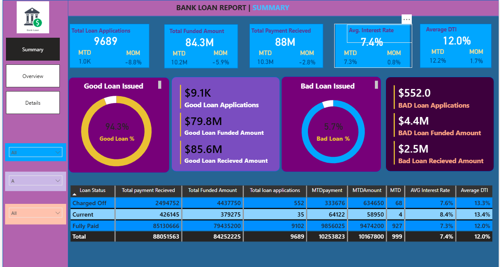

# 🏦 Bank Loan Report – Power BI Dashboard  
**End-to-End Banking Analytics Using Excel, MySQL & Power BI**

> A full business intelligence project that analyzes bank loan performance, customer behavior, and credit risk to support data-driven financial decisions.

---


https://github.com/user-attachments/assets/af6c18e8-e9ae-417a-a0a7-514c59396ffb


## 🎯 Business Objective

The purpose of this project is to analyze a bank’s loan portfolio to:

- Monitor loan growth and interest revenue  
- Identify high-risk customers and default patterns  
- Track branch and product performance  
- Improve loan approval and retention strategies  
- Reduce Non-Performing Loans (NPLs)

---

## 🛠 Tech Stack & Tools

| Tool | Purpose |
|-----|--------|
| **Excel** | Initial data cleaning & validation |
| **MySQL** | Data modeling, joins, and KPI views |
| **Power BI** | Interactive dashboards & DAX measures |
| **SQL** | KPI calculations & transformations |
| **GitHub** | Version control & documentation |

---

## 📊 Key KPIs

- Total Loan Portfolio  
- Total Interest Revenue  
- Default Rate (%)  
- Active Borrowers  
- Non-Performing Loan (NPL %)  
- Average Loan Size  
- Repeat Borrower Rate  

---

## 🧩 Data Model

### Fact Table

| Table | Description |
|-----|------------|
| `fact_loan` | Stores loan transactions and financial metrics |

### Dimension Tables

| Table | Description |
|------|------------|
| `dim_customer` | Customer demographics & segmentation |
| `dim_branch` | Branch & region information |
| `dim_loan_type` | Loan product types |
| `dim_date` | Time intelligence |

---

## 📈 Dashboard Pages

| Page | Insights |
|-----|--------|
| Executive Overview | Portfolio growth & revenue |
| Risk Analysis | Default & NPL trends |
| Branch Performance | Regional comparisons |
| Product Performance | Loan type profitability |
| Customer Segments | Repeat vs new borrowers |

---
## 📈 Dashboard View From POWERBI Visualization


---

## 🔍 Key Insights

- Personal loans contribute the highest volume but also the highest default rate  
- Urban branches generate 60% of total interest revenue  
- Repeat borrowers show a 35% lower default risk  

---

## 💡 Business Recommendations

- Tighten approval criteria for high-risk loan types  
- Introduce loyalty interest discounts for repeat borrowers  
- Improve monitoring of overdue accounts after 30 days  

---

## 🚀 How to Use

1. Import MySQL views into Power BI  
2. Refresh the dataset  
3. Interact with slicers to explore loan performance  

---

## 📁 Repository Structure

```text
Bank-Loan-Report/
│── Data/
│── SQL/
│── PowerBI/
│── Images/
│── README.md
```

---

## 📌 Dashboard Preview


---

## 👤 Author

**Umer Kassim**  
Data Analyst | Power BI Developer | MYSQL Analyst
[LinkedIn](https://linkedin.com/in/umer-kassim-51b524332)
